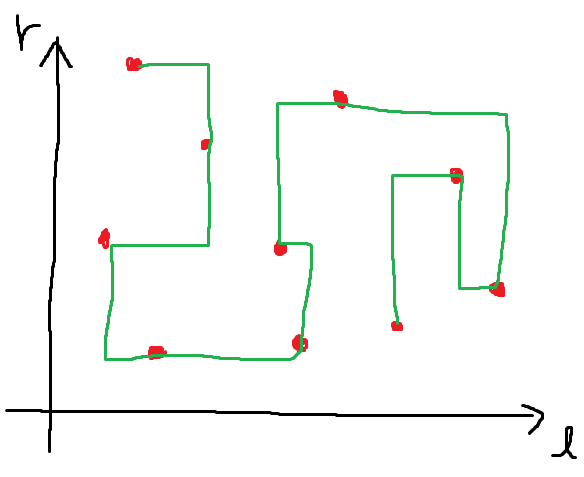

<!-- 本スライドはmarpを利用して生成しました。marpをインストールして、marp presentation --html で変換できるはずです。 -->

# Mo visualizerを作りました。
---

## これなに？

- 前回のArray visualizerに引き続き、canvasお絵描きシリーズ新作です。
- Mo's algorithmというアルゴリズムの動作をcanvasにお絵描きします。

---
## 注意点

- 趣味(競技プログラミング)色強めです。興味ない人は何言ってるのかわからないかもしれないです。(ごめんなさい)
- 時間がなくて仕上がりがイマイチかも...&#x1f62d;
- スライドに背景知識を詰め込んでしまったせいで内容がかなり多めなので、詳しく知りたい人は僕に聞いてください。

---
## Mo's algorithmについて

[AtCoder Beginner Contest 174 F - Range Set Query](https://atcoder.jp/contests/abc174/tasks/abc174_f) 改題:

> $N$個の色の付いた玉が左右一列に並んでおり、左から$i$番目の玉の色は$c _ i$です。クエリが$Q$個与えられます。$i$番目のクエリでは、左から$l _ i$番目から$r _ i$番目までにある玉のうち、色が$d _ i$であるのはいくつあるか答えてください。

制約
- $N, Q \leq 5 \times 10^5$
- $1 \leq l _ i \leq r _ i \leq N$

---
## Mo's algorithmについて

ナイーブな解法:

1. 配列`count`を用意し、`count[i]`が色$i$の球の個数を表すようにする。`count`は最初すべて$0$にする。
2. 各クエリ$(l _ i, r _ i, d _ i)$に対して、$l _ i$番目から$r _ i$番目にある玉について、`count`に加えていく。
3. `count[d _ i]`を答える。

&rarr; 正しいアルゴリズムだが、最悪ケースで$\mathcal{O}(NQ)$で間に合わない。

---
## Mo's algorithmについて

ナイーブな解法を高速化できないか考える。

例えば、クエリで与えられる区間が順番に$[5, 10], [5, 15], [7, 20]$だったとする。

&rarr; この時、いちいち`count`を初期化せずに、見ている区間を伸ばすことで効率よく回答できる。

---
## Mo's algorithmについて

区間$[5, 10], [5, 15], [7, 20]$のとき、以下のような感じにする。

    

    

    

&rarr; `count`を更新する回数をかなり節約できている！

---
## Mo's algorithmについて

要求区間が都合の良い順番であれば、普通にやるより区間の伸縮回数を抑えることができる。
&rarr; どのような順番で、どのような区間が与えられたとしても、ある程度都合の良い処理順を与えるのが**Mo's algorithm**と呼ばれるアルゴリズム。

[Mo's algorithm(クエリ平方分割)の話 - Qiita](https://qiita.com/ageprocpp/items/34121c58e571ea8c4023)によると、
2009年に中国の情報オリンピック春合宿で莫涛(Mo Tao)氏が発明したアルゴリズムらしい。

---
## 一般化されたMo's algorithmとTraveling salesman problem

Mo's algorithmは現在見ている区間をいい感じに伸ばしたり縮めたりするアルゴリズムであった。
一般化のために、現在見ている区間$[l, r]$を二次元平面上の点$(l, r)$に対応させてみる。

---
## 一般化されたMo's algorithmとTraveling salesman problem

一般化のために、現在見ている区間$[l, r]$を二次元平面上の点$(l, r)$に対応させてみる。

---
## 一般化されたMo's algorithmとTraveling salesman problem

一般化のために、現在見ている区間$[l, r]$を二次元平面上の点$(l, r)$に対応させてみる。
&rarr; 区間の伸縮は図の赤い点間の移動とみなせる。

---
## 一般化されたMo's algorithmとTraveling salesman problem

どの順番で巡回すると移動距離が最短になる？
&rarr; 厳密解は[Traveling salesman problem](https://ja.wikipedia.org/wiki/%E5%B7%A1%E5%9B%9E%E3%82%BB%E3%83%BC%E3%83%AB%E3%82%B9%E3%83%9E%E3%83%B3%E5%95%8F%E9%A1%8C)とほぼ等価な問題になる。これはNP困難で、特に制約がなければ厳密解は$\mathcal{O}(N 2^N)$時間の動的計画法で求まる。

Mo's algorithmはTSPに対するそこそこの解を見つけるアルゴリズムとみなせる。

---

長い長い前置きが終わりました...
作ったものの紹介をします。

---

## Mo's algorithm visualizer

Mo's algorithmにより与えられる点の巡回順を可視化します。

<h3>機能</h3>
<ul>
<li>クエリの自動生成。</li>
<li>総移動距離を計算。</li>
<li>hilbert orderのmoの可視化。</li>
<li>Mo's algorithmなしの可視化。</li>
</ul>

---
## デモ

ソートなし

移動距離: 69081

Mo (original)

移動距離: 8978

Mo (hilbert curve)

移動距離: 8795

---
## github pagesで公開中！

是非遊んでみてください！

- repository: [https://github.com/InTheBloom/mo-visualizer](https://github.com/InTheBloom/mo-visualizer)
- visualizer: [https://inthebloom.github.io/mo-visualizer/](https://inthebloom.github.io/mo-visualizer/)
- slide: [https://inthebloom.github.io/mo-visualizer/slide/presentation.html](https://inthebloom.github.io/mo-visualizer/slide/presentation.html)

---

ご清聴ありがとうございました。&#x1f647;&#x1f647;&#x1f647;

